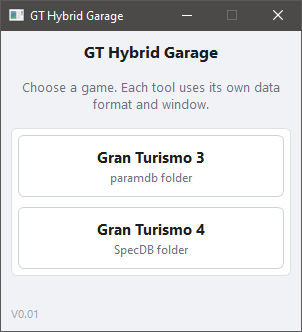
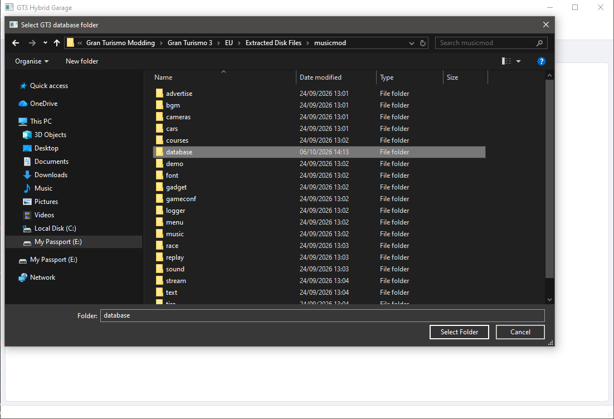
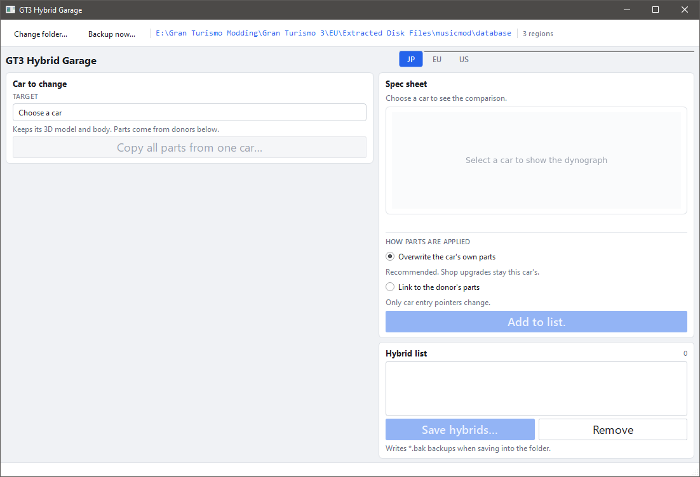
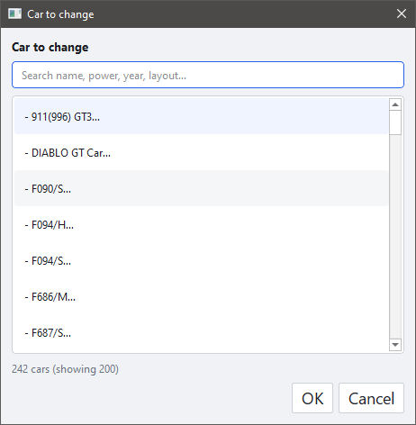
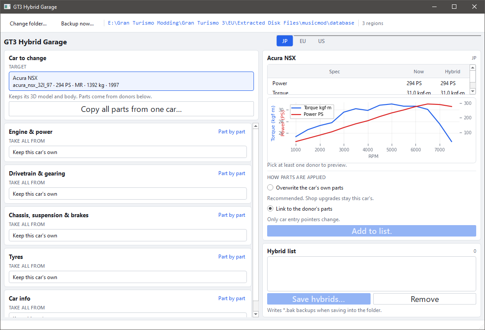
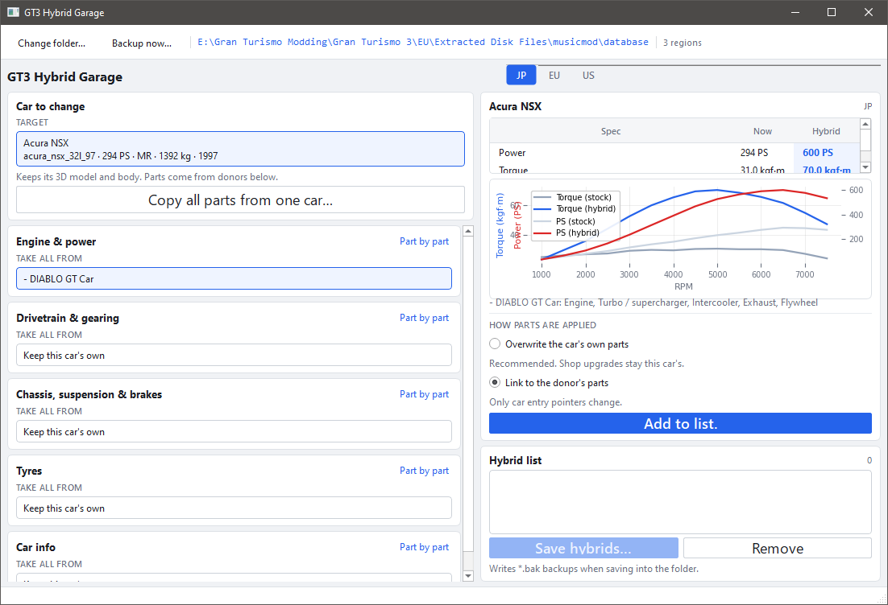

# GT Hybrid Creator

GT Hybrid Creator (GTHC) is a desktop tool for creating hybrid cars in Gran Turismo 3 and Gran Turismo 4. Pick a car to change, choose which parts to take from other cars (engine, drivetrain, chassis, tyres and so on), preview the result, and save it back to the game database.

  [](LICENSE)
  [](https://www.python.org/)
  [](https://www.riverbankcomputing.com/software/pyqt/)
  
  [](https://github.com/JeevesGB/GTHG/releases)

---

## Setup

### 1. Requirements

- Windows (the included `run.bat` is for Windows; the app itself is plain Python and Qt)
- [Python](https://www.python.org/downloads/) 3.10 or newer (developed on 3.12). On Windows, tick **Add python.exe to PATH** in the installer.
- The extracted database files from your own copy of the game (see [Game files](#game-files) below)

### 2. Get the project

Download the project as a ZIP and extract it, or clone it:

```bash
git clone <your-repo-url> gt_hybrid_garage
cd gt_hybrid_garage
```

### 3. Install dependencies

```bash
pip install -r requirements.txt
```

This installs PyQt6 (the window toolkit) and matplotlib (the dyno graph).

Optional, to keep the install isolated from the rest of your system:

```bash
python -m venv .venv
.venv\Scripts\activate
pip install -r requirements.txt
```

### 4. Run

Either double-click `run.bat`, or from a terminal:

```bash
python launcher.py
```

> `run.bat` only starts the app. It does not install anything, so complete step 3 first.

### Game files

The tool edits extracted game files, not the disc image or the console itself. Extract the files first, and **keep a separate copy of the originals** in case you want to roll back.

| Game | Folder to select | What it must contain |
| --- | --- | --- |
| Gran Turismo 3 | the extracted `database` folder | `paramdb*.db` files, plus the matching `paramstr`, `paramunistr` and `id_db_*` files so car names show up |
| Gran Turismo 4 | a SpecDB folder such as `GT4_PREMIUM_US2560` | `GENERIC_CAR.dbt` and `DEFAULT_PARTS.dbt` |

---

### First Time Setup 
Upon launching this window will appear, select which game you would like to create a hybrid for. 

<p align="center">
  
</p>

## Gran Turismo 3

### Open your database folder

Click **Gran Turismo 3** in the launcher. The first time, you are asked for the database folder. Pick the folder that holds the `paramdb*.db` files.



The folder is remembered in `folder_paths.json` (in the project folder), so the next launch opens straight into it. Use **Change folder...** in the toolbar to switch to a different one. You can also drag a folder onto the window.

Once loaded, the toolbar shows the folder path and how many regions were found. Use the **JP / EU / US** tabs to switch region. 

>Hybrids you add to the list are applied to every loaded region, so you only need to make each one once. If a car is missing from a region, that region skips the hybrid.



### Make a hybrid

**1. Choose the car to change.** Click the **Target** box and search by name, power, year or layout. This car keeps its 3D model and body.



**2. Choose donors.** Each section (Engine & power, Drivetrain & gearing, Chassis/suspension & brakes, Tyres, Car info) has a **Take all from** box. Pick the donor car, or leave it on *Keep this car's own*. Use **Part by part** to choose individual parts, or **Copy all parts from one car...** to take everything from a single donor.



**3. Check the preview.** The spec sheet compares the car as it is now against the hybrid, and the graph overlays the stock and hybrid torque and power curves. In the example below, the Acura NSX takes its engine, turbo/supercharger, intercooler, exhaust and flywheel from the Diablo GT Car.



**4. Pick how parts are applied.**

| Mode | What it does |
| --- | --- |
| **Overwrite the car's own parts** | Recommended. Copies the donor's parts into the car, so shop upgrades stay with this car. |
| **Link to the donor's parts** | Only the car entry's pointers change. The car shares the donor's parts. |

**5. Add to list, then save.** Click **Add to list.** to put the hybrid in the Hybrid list. Repeat for as many cars as you like, then click **Save hybrids...**. You can write straight into the folder or export a ZIP that leaves the folder unchanged.

### Backups

- **Backup now...** copies the loaded `paramdb` files to `*.bak` in the database folder.
- **Save hybrids...** also writes `*.bak` backups the first time it saves into the folder.
- Saving into the folder writes a `hybrids.txt` summary next to the database files.

---

## Gran Turismo 4

Click **Gran Turismo 4** in the launcher and select your SpecDB folder (for example `GT4_PREMIUM_US2560`). The path is remembered the same way as for GT3.

- Loads all cars (Huffman-compressed tables are supported)
- Pick a target car and donors for Engine, Chassis, Gear and so on, the same way as in GT3
- **Add to list.** applies the swap to `DEFAULT_PARTS` **in memory** (link mode) and adds it to the Hybrid list
- **Save hybrids...** is a placeholder for now: writing compressed `.dbt` files back is **not implemented yet**, so GT4 hybrids exist only until you close the window

---

## Troubleshooting

| Problem | Fix |
| --- | --- |
| `'python' is not recognized` | Reinstall Python and tick **Add python.exe to PATH**, or use `py launcher.py`. |
| `ModuleNotFoundError: No module named 'PyQt6'` | Run `pip install -r requirements.txt` (inside your virtual environment, if you made one). |
| No dyno graph | matplotlib is missing. Run `pip install -r requirements.txt`. |
| "No paramdb*.db found" | You selected the wrong folder. Pick the one that directly contains the `.db` files. |
| It keeps asking for the folder | The saved folder no longer exists, or the project folder is read-only so `folder_paths.json` cannot be written. |

---

V0.01
